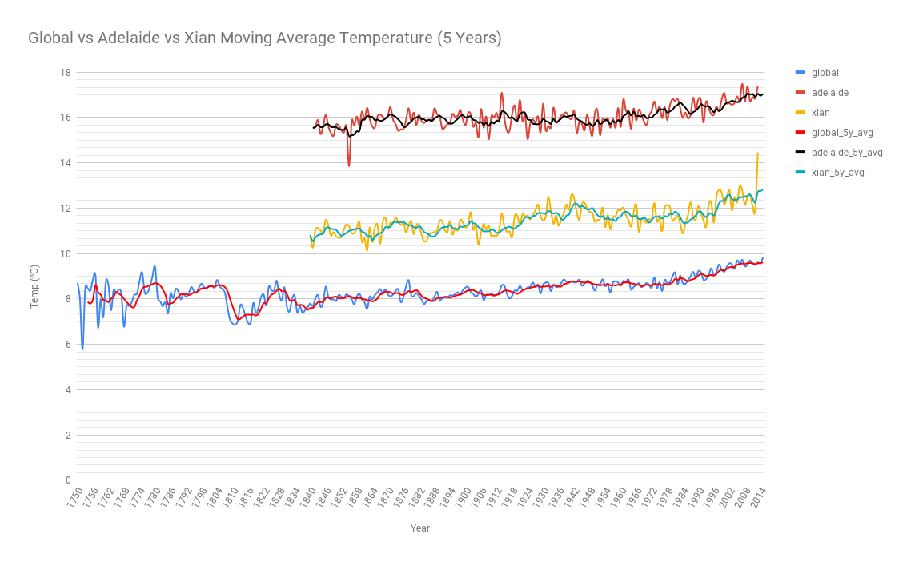
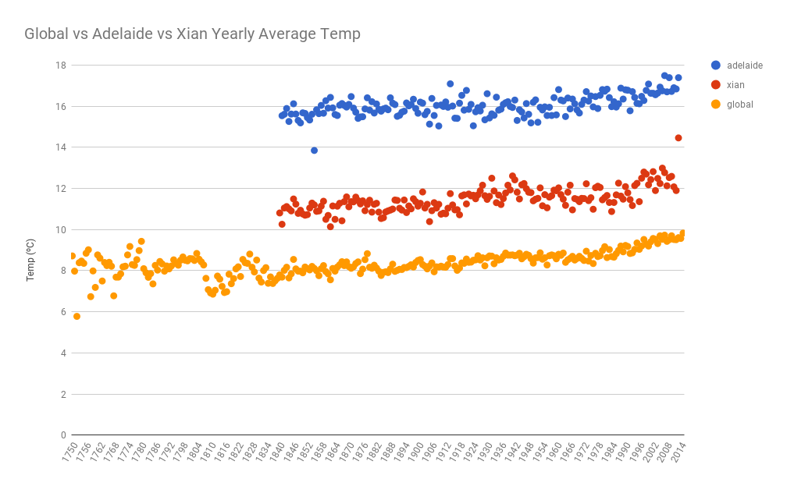

# 探索阿德莱德及西安的未来气候发展趋势

<!-- TOC -->

- [探索阿德莱德及西安的未来气候发展趋势](#探索阿德莱德及西安的未来气候发展趋势)
  - [气候数据获取及处理](#气候数据获取及处理)
  - [数据处理](#数据处理)
  - [气候的观察与发现](#气候的观察与发现)
    - [1. 总体气温变化幅度](#1-总体气温变化幅度)
    - [2. 总体气温变化趋势](#2-总体气温变化趋势)
    - [3. 年平均气温变化趋势](#3-年平均气温变化趋势)
    - [4. 气温差异](#4-气温差异)

<!-- /TOC -->

这篇报告是优达学城数据分析纳米学位的第一个项目的作业。在这份报告中，我们将会通过分析1750年至2015年的气候数据，来探索澳大利亚阿德莱德和中国西安于全球气候变化的关系。首先我们会计算出1750年至2015年气温数据的**移动平均数**，然后再将它以可视化方式展现出来。最后根据数据的变化图提出四项观察分析。

## 气候数据获取及处理

1. 确定城市名

    首先我们通过SQL语句中的```LIKE```关键字模糊查询到了阿德莱德在我们的```city_list```中。

    ```sql
    SELECT *
    FROM city_list
    WHERE city LIKE 'Adelaide';
    ```

    然而当我用同样的SQL语句模糊查询西安的时候，系统却没有找到。

    ```sql
    SELECT *
    FROM city_list
    WHERE city LIKE 'XiAn';
    ```

    于是我列出了全部中国的城市，然后发现原来```WHERE```的查询是区分大小写的，西安正确的查询语句为```'Xian'```。

    ```sql
    SELECT *
    FROM city_list
    WHERE country LIKE 'China';
    ```

2. 导出气候数据

    通过下面的SQL语句查询出1750年至2015年全球的平均气温(ºC)
    ```sql
    SELECT *
    FROM global_data;
    ```

    通过下面的SQL语句查询出西安(Xian)和阿德莱德(Adelaide)的1820年至2013年的年平均气温(ºC)。

    ```sql
    SELECT *
    FROM city_data
    WHERE city = 'Xian';
    ```
    ```sql
    SELECT *
    FROM city_data
    WHERE city = 'Adelaide';
    ```

## 数据处理

为了便于数据处理，我把这三组数据导入到了Google Sheets里，你可以通过这个[链接](https://docs.google.com/spreadsheets/d/120TBdFWjVPjxAHPRqfpSzKMtIGbOLMjwFTij7tHlVjM/edit?usp=sharing)来访问我的图表。我对数据进行了一下的操作：

1. 将阿德莱德和西安的气温数据与全球气温数据放在同一个工作表中，确保阿德莱德和西安的气温数据从正确的年份开始，这样在绘制图表时才可以比较直观的观察到每年的气温变化。
2. 因为气温的变化通常比较缓慢和微小，这里我计算的是以**5年**为单位的移动平均数，原因如下：
    * 如果选择的过于小的计算单位，可能会影响移动平均数对气温变化趋势的反应，因为这样的计算更偏近于年份之间的气温变化。
    * 如果选择过大的计算单位，由于太多年份被纳入到计算中，这会可能导致气温的移动平均数出现较大的变化幅度。

## 气候的观察与发现

<p align="center">
    
</p >
<p align="center">
    <em>图1: 全球vs阿德莱德vs西安气温变化5年移动平均值</em>
</p>

### 1. 总体气温变化幅度

从图中我们可以看到全球的总体气温从1754年的7.86摄氏度缓慢的提升了约**2摄氏度**到达2015年的9.6摄氏度。而阿德莱德与西安的气温在1840年至2013年间分别升高了1.5摄氏度和2摄氏度左右。这说明阿德莱德和西安这两个地区的气温升高基本符合全球气温升高的幅度。

### 2. 总体气温变化趋势

通过观察1840年至2013年间的全球，阿德莱德和西安的5年移动平均气温指标，我们可以发现阿德莱德和西安的气温变化是与全球气温变化保持相同的趋势的，具体的变现为:

* 在1864，1888，1987等几个年份上，全球，阿德莱德和西安的5年移动平均气温都清晰的表现出了下降后的开始回升的趋势。
* 在1943，1962年的5年移动平均气温指数则表现出全球，阿德莱德和西安的气温开始了新一轮的下降的趋势。
* 如果我们详细的对比阿德莱德和全球的5年移动平均气温指标，我们会发现尽管总体的气温变化趋势都是升高，但是在某些时间点上，阿德莱德的气温变化是与全球的气温变回相反的，比如1915年至1935年的20年间，阿德莱德地区的5年移动平均气温指标描述出气温变化趋势是从16.2摄氏度请问下降到了0.5摄氏度到达15.7摄氏度，而同期的全球和西安地区的气温变化则是轻微升高了0.3和0.7摄氏度。

### 3. 年平均气温变化趋势
<p align="center">
    
</p>
<p align="center">
    <em>图2: 全球年平均气温变化散点图</em>
</p>
从图中我们可以看到全球的年平均气温在逐年的缩小其变化范围，如在1750年至1770年间最高和最低的年平均气温差距可以达到3摄氏度。而1994年至2014年间的最大和最低年平均气温差距仅为0.5摄氏度。

相反的对于阿德莱德和西安这两个城市的年平均气温的变化区间并没有表现出收缩的趋势，其最大和最小气温的变化区间始终保持在为2度左右。

### 4. 气温差异

从图1中我们可以明确的发现，西安和阿德莱德的年平均气温都要高出全球的平均气温，这是因为全球的气温包含了从热带到两极的气温，而西安和阿德莱德则是相对具体的城市，基于他们自己所处的地区的气候，他们的年平均气温高于全球气温是正常的情况。

* 阿德莱德属于地中海气候，冬季温暖多雨，而夏季干燥炎热。
* 西安属于温带湿润季风性气候，四季分明冬季有降雪，夏季炎热多雨。